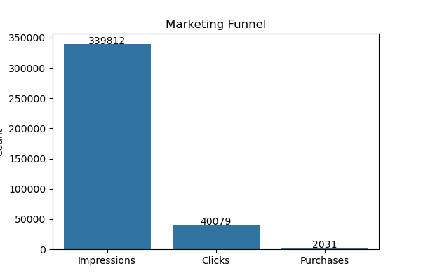

# User Behavior Funnel Analysis

## Summary
This project analyzes event-level user behavior data to identify drop-off points in a marketing funnel and provide actionable business insights to improve conversion performance.

---

## Visualization

---

## Objective
Analyze user interactions (impression → click → purchase) to evaluate funnel efficiency and identify areas for optimization.

---

## Dataset
https://www.kaggle.com/datasets/alperenmyung/social-media-advertisement-performance

---

## Funnel Definition
- Impression: user views the ad  
- Click: user interacts with the ad  
- Purchase: treated as conversion event  

---

## Key Metrics
- Click-Through Rate (CTR)  
- Purchase Rate (end-to-end conversion)  
- Conversion Rate (click → purchase)  

---

## Results

- Impressions: 339,812  
- Clicks: 40,079  
- Purchases: 2,031

---

## Key Insights

- Only ~12% of impressions lead to clicks, indicating low top-of-funnel engagement  
- Purchase rate is extremely low, suggesting significant drop-off at the conversion stage  
- Engagement events (likes, shares, comments) indicate user interest but weak purchase intent  

---

## Business Recommendations

- Improve ad targeting and creatives to increase CTR  
- Optimize landing page experience to improve conversion rates  
- Use engagement signals (likes, shares) for retargeting strategies  

---

## Tools Used

- Python (Pandas, Matplotlib, Seaborn)  
- Jupyter Notebook  

---

## Project Structure

- Data cleaning and preparation  
- KPI calculation  
- Funnel analysis  
- Visualization  
- Business insights  
